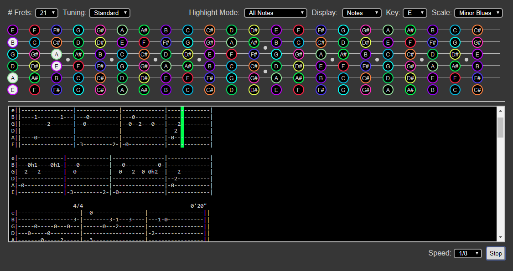

# JS Tuner

A simple web app allowing that helps visualize scales and notes on the guitar fretboard.  The app can interpret guitar tablature and playback tabs.

## Configurations

The app can be customized to change the number of displayed frets, change tunings, and highlight notes based on a selected key or scale.

## Playback

Tabs can be copied and pasted into the text area below the fretboard and played at different speeds, adjustable at the bottom right.

## Live
[https://tuner.transitwinds.com/](https://tuner.transitwinds.com/)

## TODO

- fix tunings (all notes are for standard, the string/fret combo doesn't work